# CRD ClusterInfo & Controller

## Introduction

- As issue [#1376](https://github.com/volcano-sh/volcano/issues/1376) and [#1396](https://github.com/volcano-sh/volcano/issues/1396) mentioned, Volcano need to collect cluster resource information to monitor cluster resources, and update periodically for federation scheduling scenario.
- So a new Custom Resource Definition `ClusterInfo` was proposed to save cluster resource information, and a new controller `clusterinfo_controller` to manage the `ClusterInfo`.

## Custom Resource Definition `ClusterInfo`

Currently `ClusterInfo` records 5 items:

1. `totalNodes`: number of all nodes in cluster;
2. `readyNodes`: resource info of nodes in Ready status;
3. `labeledNodes`: resource info of nodes with specified labels;
4. resource info of selected nodes:
   1. `nodes`: number of nodes;
   2. `allocatable`: the amount of available resources of nodes, which should be the sum of idle & used resources;
   3. `used`: the amount of available resources of nodes, which have been occupied by pods;
   4. `idle`: the amount of idle resources of nodes, which have not been occupied yet;

### Definition

```yaml
apiVersion: apiextensions.k8s.io/v1
kind: CustomResourceDefinition
metadata:
  annotations:
    controller-gen.kubebuilder.io/version: v0.4.1
  creationTimestamp: null
  name: clusterinfos.federation.volcano.sh
spec:
  group: federation.volcano.sh
  names:
    kind: ClusterInfo
    listKind: ClusterInfoList
    plural: clusterinfos
    shortNames:
    - ci
    - ci-v1alpha1
    singular: clusterinfo
  scope: Cluster
  versions:
  - name: v1alpha1
    schema:
      openAPIV3Schema:
        description: ClusterInfo defines structure of cluster information.
        properties:
          apiVersion:
            description: 'APIVersion defines the versioned schema of this representation
              of an object. Servers should convert recognized schemas to the latest
              internal value, and may reject unrecognized values. More info: https://git.k8s.io/community/contributors/devel/sig-architecture/api-conventions.md#resources'
            type: string
          kind:
            description: 'Kind is a string value representing the REST resource this
              object represents. Servers may infer this from the endpoint the client
              submits requests to. Cannot be updated. In CamelCase. More info: https://git.k8s.io/community/contributors/devel/sig-architecture/api-conventions.md#types-kinds'
            type: string
          metadata:
            type: object
          spec:
            description: Specification of the desired behavior of the cluster info,
              including cluster name, api server URL, and resources.
            properties:
              labeledNodes:
                additionalProperties:
                  description: ResourceInfo describes detailed resource information
                    of nodes
                  properties:
                    allocatable:
                      additionalProperties:
                        anyOf:
                        - type: integer
                        - type: string
                        pattern: ^(\+|-)?(([0-9]+(\.[0-9]*)?)|(\.[0-9]+))(([KMGTPE]i)|[numkMGTPE]|([eE](\+|-)?(([0-9]+(\.[0-9]*)?)|(\.[0-9]+))))?$
                        x-kubernetes-int-or-string: true
                      description: Allocatable is the available resource amount of
                        a cluster, which should be the sum of idle & used resources
                      type: object
                    idle:
                      additionalProperties:
                        anyOf:
                        - type: integer
                        - type: string
                        pattern: ^(\+|-)?(([0-9]+(\.[0-9]*)?)|(\.[0-9]+))(([KMGTPE]i)|[numkMGTPE]|([eE](\+|-)?(([0-9]+(\.[0-9]*)?)|(\.[0-9]+))))?$
                        x-kubernetes-int-or-string: true
                      description: Idle is the idle resource amount of a cluster
                      type: object
                    nodes:
                      description: Nodes the number of nodes with specified label
                        in cluster
                      format: int32
                      type: integer
                    used:
                      additionalProperties:
                        anyOf:
                        - type: integer
                        - type: string
                        pattern: ^(\+|-)?(([0-9]+(\.[0-9]*)?)|(\.[0-9]+))(([KMGTPE]i)|[numkMGTPE]|([eE](\+|-)?(([0-9]+(\.[0-9]*)?)|(\.[0-9]+))))?$
                        x-kubernetes-int-or-string: true
                      description: Used is the used resource amount of a cluster,
                        which are occupied by running pods
                      type: object
                  type: object
                description: LabeledNodes is node info with specified labels
                type: object
              readyNodes:
                description: ReadyNodes is the number of nodes in Ready status
                properties:
                  allocatable:
                    additionalProperties:
                      anyOf:
                      - type: integer
                      - type: string
                      pattern: ^(\+|-)?(([0-9]+(\.[0-9]*)?)|(\.[0-9]+))(([KMGTPE]i)|[numkMGTPE]|([eE](\+|-)?(([0-9]+(\.[0-9]*)?)|(\.[0-9]+))))?$
                      x-kubernetes-int-or-string: true
                    description: Allocatable is the available resource amount of a
                      cluster, which should be the sum of idle & used resources
                    type: object
                  idle:
                    additionalProperties:
                      anyOf:
                      - type: integer
                      - type: string
                      pattern: ^(\+|-)?(([0-9]+(\.[0-9]*)?)|(\.[0-9]+))(([KMGTPE]i)|[numkMGTPE]|([eE](\+|-)?(([0-9]+(\.[0-9]*)?)|(\.[0-9]+))))?$
                      x-kubernetes-int-or-string: true
                    description: Idle is the idle resource amount of a cluster
                    type: object
                  nodes:
                    description: Nodes the number of nodes with specified label in
                      cluster
                    format: int32
                    type: integer
                  used:
                    additionalProperties:
                      anyOf:
                      - type: integer
                      - type: string
                      pattern: ^(\+|-)?(([0-9]+(\.[0-9]*)?)|(\.[0-9]+))(([KMGTPE]i)|[numkMGTPE]|([eE](\+|-)?(([0-9]+(\.[0-9]*)?)|(\.[0-9]+))))?$
                      x-kubernetes-int-or-string: true
                    description: Used is the used resource amount of a cluster, which
                      are occupied by running pods
                    type: object
                type: object
              totalNodes:
                description: TotalNodes is the number of all nodes in cluster
                format: int32
                type: integer
            type: object
        type: object
    served: true
    storage: true
status:
  acceptedNames:
    kind: ""
    plural: ""
  conditions: []
  storedVersions: []
```

### Sample

```yaml
apiVersion: "federation.volcano.sh/v1alpha1"
kind: ClusterInfo
metadata:
  name: cluster-info-sample
spec:
  totalNodes: 10
  readyNodes:
    nodes: 8
    allocatable:
      cpu: 100m
      memory: 1Gi
    used:
      cpu: 100m
      memory: 1Gi
    idle:
      cpu: 100m
      memory: 1Gi
  labeledNodes:
    nodeType=GPU:
      nodes: 1
      allocatable:
        cpu: 100m
        memory: 1Gi
      used:
        cpu: 100m
        memory: 1Gi
    application=spark:
      nodes: 1
      allocatable:
        cpu: 100m
        memory: 1Gi
      idle:
        cpu: 100m
        memory: 1Gi
```

## `clusterinfo` Controller to Manage new CRD

- A new controller `ci_controller` is proposed to manage CRD `ClusterInfo`. In each period, `ci_controller` watches CRD status, and create, update, or delete `ClusterInfos`.

### configuration

- A new configmap is involved to restore configurations of controllers. For `ci_controller`, configmap save labels to divide nodes. `ci_controller` record resources of nodes with same labels, then update `ClusterInfo`.

### process

- CREATE: when `clusterinfo controller` cannot get `ClusterInfo` by given name from `vcclient`, it will create a nil `ClusterInfo` with given name;
- UPDATE: In each period, controller invoke `nodeInformer` and `podInformer` to collect cluster resources info, then calculate resources of nodes with same label, finally update `ClusterInfo`;
- DELETE: By default there should be one and only one `ClusterInfo` with given name exists in cluster at one time, so plural `ClusterInfo` should be deleted; Besides this deletion, `ClusterInfo` should always exist until volcano is deleted.

### workflow



## Feature Interaction

To add a new CRD in volcano, the following models were modified:

1. Makefile: add new CRD in [manifests](https://github.com/volcano-sh/volcano/blob/e47cfe740b93d2349101b0d3eef3385d255a5309/Makefile#L116) to create yaml files from definition;
2. hack/update-gencode.sh: add new group to generate [interface code](https://github.com/volcano-sh/volcano/blob/e47cfe740b93d2349101b0d3eef3385d255a5309/hack/update-gencode.sh#L31);
3. hack/generate-yaml.sh: add yaml files in [helm CRD directory](https://github.com/volcano-sh/volcano/blob/e47cfe740b93d2349101b0d3eef3385d255a5309/hack/generate-yaml.sh#L75) for bases & v1beta1. Meanwhile add a new template to compose [volcano-development.yaml](https://github.com/volcano-sh/volcano/blob/e47cfe740b93d2349101b0d3eef3385d255a5309/hack/generate-yaml.sh#L112);
4. yaml template: create a new file in `installer/helm/chart/volcano/templates/` to refer to crd templates;

## Future Improvement

1. Currently the `clusterinfo` controller go through all nodes and pod periodically, which is time-consuming & not timely. An event response structure may be better, which needs discuss.
2. Currently `ClusterInfo` CRD only collects simple resource information, which should be extended for more detailed requirements in monitoring and federation.
3. In multi-cluster federation scheduling, master cluster needs to differ each member cluster, and the identification should be added into `ClusterInfo` CRD
